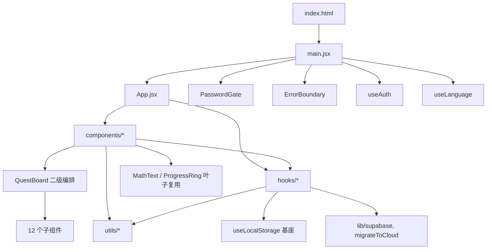
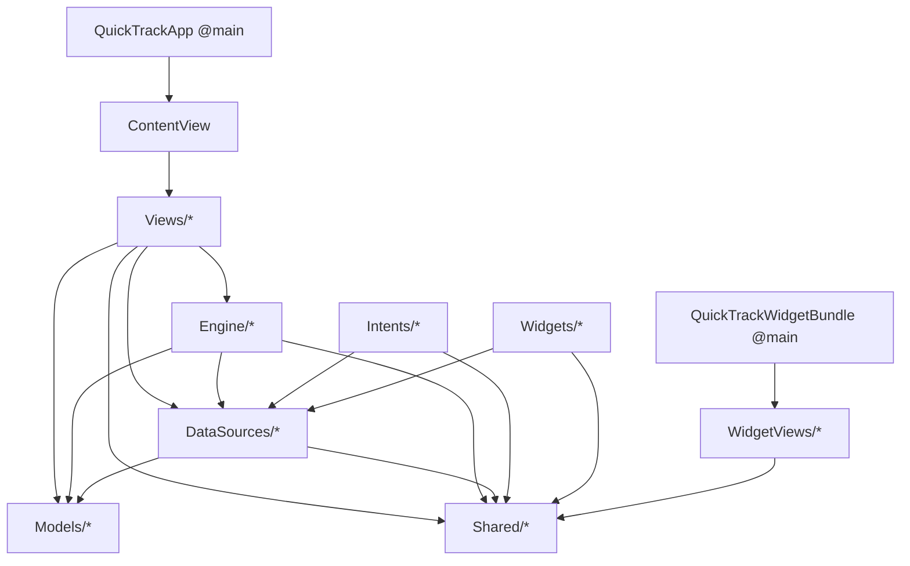

# DEPENDENCIES.md — 模块耦合分析

> 分析方式：**仅静态分析**（只读，未修改任何源文件）。
> - Web（`src/`）：解析 ES `import` 语句构建引用图（共抽取 252 条相对引用边）。
> - iOS（`ios/`）：Swift 同一 target 内无文件级 import，类型在模块内全局可见；故以「类型声明 → 跨文件类型名引用」近似建图（186 个类型声明）。
> - 引用是否「实际可达」凡有疑问处均已标注「不确定」。

---

## 0. 方法与可信度说明（先读）

- **Web 图可信度：高**。JS 用显式相对 import，边可精确解析；未发现动态 `import()` 或字符串拼接式引用绕过静态分析。in-degree 以「被 import 的文件 basename」计数——本仓库 `src/` 内 basename 唯一，故计数准确。
- **iOS 图可信度：中**。Swift 模块内靠类型名引用，用 `grep -w <类型名>` 跨文件统计：
  - 通用名（如 `Config`、`XP`、`Mood`、`Phase`、`Keys`、`Tracker`）可能被**轻微高估**（同名局部变量/子串）。
  - SwiftUI 视图可能仅经预览或运行期实例化而被**低估**为零引用。
  - 故 iOS 的「中心模块」「孤岛」结论均标注了不确定性。

---

## 1. 模块间引用关系

### 1.1 Web 子系统（`src/`）—— 严格分层

实测呈干净的单向分层，无跨层回边：

```
index.html
  └─> main.jsx ─> { App.jsx, PasswordGate, ErrorBoundary, useAuth, useLanguage }
                     │
                     ▼
        App.jsx  (编排器, out-degree=61：导入几乎所有组件与 Hook)
                     │
        ┌────────────┼─────────────┐
        ▼            ▼             ▼
   components/     hooks/        utils/ + lib/
        │            │             ▲
        ├────────────┴─────────────┘   (components、hooks 都向下依赖 utils/lib)
        │
        └─> QuestBoard.jsx (二级编排器, out-degree=15)
              └─> 12 个子组件 (QuestCard, ChallengeMode, DailyReflection,
                   StudyRoadmap, SkillTree, MicroLearn, LifeHabitDashboard,
                   TodayDashboard, RecentTasks, EnergyBudget, PresetPicker, ...)
```

Mermaid：



**关键分层事实（均经实测验证）：**
- `utils/*` **不引用** `hooks/` 或 `components/`（0 处）→ 最底层。
- `hooks/*` **不引用** `components/`（0 处）。
- **Hook 之间互不引用**（除基座 `useLocalStorage`/`useLanguage`/`useAuth` 外，0 处 hook→hook）——所有业务 Hook 相互独立，由 `App.jsx` 在顶层组合。这是该项目刻意的「Hook 平铺」设计。
- `components → components` 仅形成树状（`App → QuestBoard → 子组件`；叶子 `MathText`、`ProgressRing` 被广泛复用且自身不再引用任何组件）。

### 1.2 iOS 子系统（`ios/`）—— 干净的分层架构



**实测的跨目录方向（用于确认无环）：**
- `Shared/`（`Config`、`AppGroupManager`、`ColorHex`、`QuestSessionAttributes`）= 公共基座，被所有目录引用（Widget 扩展也有 10 个文件引用它）。
- `Engine/ → DataSources/`：成立（`WeeklyInsightEngine`、`RewardChain`、`EngagementEngine` 引用 `SyncManager`/`SupabaseAdapter`）。
- `DataSources/ → Engine/`：**0 处** → 二者无环。
- `Intents/ → DataSources/ + Shared/`（`CompleteStepIntent`、`LogEventIntent`）；`Intents/ → Engine/`：0 处。
- `Widgets/ → DataSources/`（适配器）+ `Shared/`：Widget 扩展通过 `project.yml` 的 **target 成员共享**了 `DataSources`/`Shared` 源文件（并非跨模块 import），在 TimelineProvider 中直接调用适配器取数。

---

## 2. 循环依赖

### Web：**未发现循环依赖**（高可信）
严格单向分层 + Hook 平铺 + 叶子组件无回边，已逐项验证（`utils↛hooks/components`、`hooks↛components`、`hook↛hook`、`MathText/ProgressRing` 为纯叶子）。

### iOS：**未发现目录级循环依赖**（中可信）
- 唯一需警惕的方向 `Engine ⇄ DataSources` 经验证为单向（`DataSources` 不反向引用 `Engine`）。
- ⚠️ **不确定**：因 Swift 模块内类型全局可见，文件级（非目录级）的环无法用 grep 穷尽证伪。基于目录分层干净，存在文件级环的概率低，但本分析**未做文件级穷举**，此处保留不确定标注。

---

## 3. 被引用最多的「中心模块」（改动风险最高）

### Web —— 按 in-degree（被多少文件 import）

| 排名 | 模块 | 被引用数 | 角色 | 改动风险 |
|------|------|---------|------|---------|
| 1 | `hooks/useLanguage` | 48 | i18n 上下文，几乎每个组件都用 | 🔴 极高 |
| 2 | `utils/constants` | 28 | 全局常量（CATEGORIES/LEVELS/XP/THEMES…） | 🔴 极高 |
| 3 | `hooks/useLocalStorage` | 24 | 所有持久化 Hook 的基座 | 🔴 极高 |
| 4 | `components/MathText` | 11 | LaTeX 渲染叶子组件 | 🟠 高 |
| 5 | `utils/gameLogic` | 8 | `getLevel/getStepXp/generateId` | 🟠 高 |
| 6 | `components/ProgressRing` | 7 | SVG 进度环叶子组件 | 🟠 高 |
| 7 | `hooks/useAuth` | 6 | 认证上下文 | 🟠 高 |
| 8 | `utils/reflectionModes` | 5 | 反思模式配置 | 🟡 中 |
| — | `lib/supabase`、`utils/fileExtractor`、`utils/aiService`、`utils/aiProviders` | 各 4 | — | 🟡 中 |

> 另：`App.jsx` 虽 in-degree 低，但 **out-degree=61**，是事实上的「中枢」——任何被它编排的回调（如 `handleToggleStep` 链）改动，波及面最大。

### iOS —— 按跨文件类型引用数

| 排名 | 类型 | 被引用文件数 | 所在文件 | 备注 |
|------|------|------------|---------|------|
| 1 | `Config` | 28 | `Shared/Config.swift` | 🔴 配置/密钥基座（通用名，或略高估） |
| 2 | `XP` | 26 | `Shared/Config.swift` | 🔴 XP 常量命名空间（同上，或略高估） |
| 3 | `HapticEngine` | 22 | `Engine/HapticEngine.swift` | 🔴 全局触感单例 |
| 4 | `QuestRow` | 18 | `DataSources/SupabaseAdapter.swift` | 🔴 Supabase 任务行模型 |
| 5 | `SyncManager` | 17 | `DataSources/SyncManager.swift` | 🔴 同步编排核心 |
| 6 | `AppGroupManager` | 16 | `Shared/AppGroupManager.swift` | 🔴 App Group 存储 |
| 7 | `TrackerSummary` | 12 | `Models/TrackerSummary.swift` | 🟠 |
| 7 | `ThemeManager` | 12 | `Engine/ThemeManager.swift` | 🟠 |
| 9 | `QuestStep` | 10 | `DataSources/SupabaseAdapter.swift` | 🟠 |
| 9 | `EngagementEngine` | 10 | `Engine/EngagementEngine.swift` | 🟠 |

> 改动 `Shared/Config.swift`、`Shared/AppGroupManager.swift`、`DataSources/SupabaseAdapter.swift`、`DataSources/SyncManager.swift`、`Engine/HapticEngine.swift` 风险最高——它们横跨 App + Widget 两个 target。

---

## 4. 零引用的「孤岛文件」（可能已死亡）

### Web —— 确认零 import（高可信）

| 文件 | 行数 | 判断 | 佐证 |
|------|------|------|------|
| `src/hooks/useCloudStorage.js` | 220 | 🟥 死代码（孤岛） | 全 `src/` 无 import；`CLAUDE.md` 自述「available but not primary」 |
| `src/hooks/useModalManager.js` | ~60 | 🟥 死代码（孤岛） | 全 `src/` 无 import；属 Roadmap「App.jsx 拆分」未接线的产物（其姊妹 `useStepCompletionChain` 已被 `App.jsx` 引用，本文件未被引用） |
| `src/utils/claudeClient.js` | ~50 | 🟥 死代码（孤岛） | 全 `src/` 无 import；功能已被 `aiProviders.js` / `aiService.js` 取代 |

### iOS —— 零跨文件引用（中可信）

| 文件 | 行数 | 判断 | 说明 |
|------|------|------|------|
| `Views/QuickCheckInView.swift` | 201 | 🟥 疑似死视图 | 除自身 `struct QuickCheckInView` 声明外，全工程无任何引用 |
| `Views/TrackerListView.swift` | 143 | 🟥 疑似死视图 | 同上；疑为早期通用「Tracker」模型阶段遗留（当前 UI 已转向 Quest 中心化的 `TodayView`/`QuestsView`） |

> ⚠️ **以下 3 个文件「看似零引用、实则是入口、并非死代码」**，已从孤岛中剔除：
> - `QuickTrack/QuickTrackApp.swift`（`@main`）
> - `QuickTrackWidget/QuickTrackWidgetBundle.swift`（`@main`）
> - `Intents/QuickTrackShortcuts.swift`（`AppShortcutsProvider`，由系统框架发现）
>
> 这正是 iOS 静态分析的不确定性来源：是否「可达」需结合框架约定判断，不能仅看类型名引用数。`QuickCheckInView`/`TrackerListView` 不属于任何已知框架入口约定，故判为疑似死代码——但**建议人工复核**（确认无 `#Preview` 之外的运行期实例化）后再删除。

---

## 5. 小结与建议

1. **整体耦合健康**：Web 与 iOS 两个子系统都是干净的单向分层，**无循环依赖**。
2. **高风险中心**：Web 的 `useLanguage`/`constants`/`useLocalStorage` 与 `App.jsx` 中枢；iOS 的 `Shared/*` 与 `DataSources/SupabaseAdapter`/`SyncManager`、`Engine/HapticEngine`——改动前应优先补测试。
3. **可清理的死代码**（建议人工确认后处理，本分析未做任何删除）：Web 3 个孤岛 Hook/util + iOS 2 个孤岛视图。

*报告结束 —— 仅静态分析，未运行构建，未修改任何被分析的源文件。*
